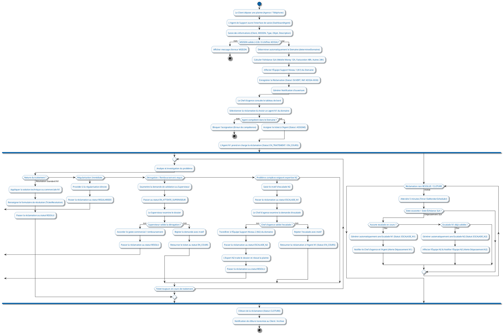

# Diagramme d'Activité UML - Cycle de Vie d'une Réclamation

Ce document contient le diagramme d'activité UML modélisant le cycle de vie complet d'une réclamation au sein du système **Kossa** (KOSSA Africa), incluant la saisie, la validation de formulaire, le routage par domaine, l'affectation par le Manager, les branches de traitement (Résolution, Dérogation Superviseur, Escalade N2) et le contrôle SLA automatique.

## Code PlantUML

