# Diagramme de Cas d'Utilisation UML - Kossa

Ce document contient le diagramme de cas d'utilisation (Use Case Diagram) complet du système **Kossa** (KOSSA Africa). Il présente l'ensemble des acteurs (Agent, Manager, Superviseur, Administrateur, Système SlaMonitor) et leurs interactions avec l'application.

## Code PlantUML

```plantuml
@startuml Diagramme_CasUtilisation_Kossa

' --- OPTION DE STYLE KOSSA AFRICA ---
skinparam shadowing true
skinparam backgroundColor #FFFFFF

skinparam actor {
    BackgroundColor #FFF8F0
    BorderColor #F37A21
    FontColor #0060A8
    FontSize 12
    FontName Arial
}

skinparam usecase {
    BackgroundColor #F8F9FA
    BorderColor #0060A8
    ArrowColor #0060A8
    FontColor #0060A8
    FontSize 11
    FontName Arial
}

skinparam package {
    BorderColor #0060A8
    FontColor #0060A8
}

' --- ACTEURS ---
actor "Agent de Support" as Agent
actor "Chef d'agence" as ChefAgence
actor "Superviseur d'Agence" as Superviseur
actor "Administrateur" as Admin
actor "Système SLA (Batch Scheduler)" as System << System >>

' --- SYSTÈME / USE CASES ---
rectangle "Kossa System" {

    ' Package Saisie et Consultation
    package "Gestion des Réclamations" {
        usecase "Saisir réclamation (Point d'entrée)" as UC_CreateReclamation
        usecase "Valider MSISDN (+226 KOSSA)" as UC_ValiderMsisdn
        usecase "Consulter réclamations attribuées" as UC_ViewAgentTickets
        usecase "Traiter réclamation (Passer en cours)" as UC_ProcessTicket
        usecase "Ajouter commentaire & pièce jointe" as UC_AddComment
        usecase "Régulariser immédiatement N1" as UC_Regulariser
    }

    ' Package Affectation & Workflow Manager
    package "Affectation & Escalade Manager" {
        usecase "Consulter tableau de bord Manager" as UC_ManagerDashboard
        usecase "Assigner ticket à un agent (Contrôle compétence)" as UC_AssignTicket
        usecase "Examiner demande escalade N2" as UC_ReviewEscalation
        usecase "Valider escalade N2 (Affecter Équipe N2)" as UC_ApproveEscalation
        usecase "Rejeter escalade N2 (Retour N1)" as UC_RejectEscalation
        usecase "Renseigner résolution & clôturer ticket" as UC_ResolveTicket
        usecase "Exporter rapports (PDF / CSV Excel)" as UC_ExportReports
    }

    ' Package Dérogation & Supervision
    package "Supervision & Dérogations" {
        usecase "Soumettre demande dérogation/remboursement" as UC_RequestDerogation
        usecase "Consulter activité périmètre agence" as UC_SupervisorView
        usecase "Valider dérogation (Passer RESOLU)" as UC_ApproveDerogation
        usecase "Rejeter dérogation (Passer EN_COURS)" as UC_RejectDerogation
        usecase "Déclencher escalade immédiate N2" as UC_ImmediateEscalation
    }

    ' Package Administration & Référentiel
    package "Administration Système & Agence" {
        usecase "Authentification JWT (Login)" as UC_Login
        usecase "Gérer les utilisateurs (CRUD, Équipe, Agence)" as UC_ManageUsers
        usecase "Administrer le référentiel (Catégories, SLA, Types)" as UC_ManageRef
        usecase "Filtrer opérations par Agence (X-Agence-Id)" as UC_FilterAgence
    }

    ' Package Détection Automatique SLA
    package "Surveillance SLA Automatique" {
        usecase "Vérifier dépassement SLA (Toutes les 5 min)" as UC_CheckSLA
        usecase "Déclencher escalade N1 automatique" as UC_AutoEscalateN1
        usecase "Déclencher escalade N2 automatique" as UC_AutoEscalateN2
        usecase "Notifier agent et manager" as UC_SendNotification
    }
}

' --- RELATIONS INCLUDES & EXTENDS ---
UC_CreateReclamation .> UC_ValiderMsisdn : <<include>>
UC_CreateReclamation .> UC_FilterAgence : <<include>>

UC_ReviewEscalation <|-- UC_ApproveEscalation
UC_ReviewEscalation <|-- UC_RejectEscalation

UC_RequestDerogation .> UC_ProcessTicket : <<extend>>

UC_ManageUsers .> UC_FilterAgence : <<include>>

UC_CheckSLA .> UC_AutoEscalateN1 : <<extend>>
UC_CheckSLA .> UC_AutoEscalateN2 : <<extend>>
UC_AutoEscalateN1 .> UC_SendNotification : <<include>>
UC_AutoEscalateN2 .> UC_SendNotification : <<include>>

' --- RELATIONS ACTEURS <-> USE CASES ---
Agent --> UC_Login
Agent --> UC_CreateReclamation
Agent --> UC_ViewAgentTickets
Agent --> UC_ProcessTicket
Agent --> UC_AddComment
Agent --> UC_Regulariser
Agent --> UC_RequestDerogation
Agent --> UC_ReviewEscalation

ChefAgence --> UC_Login
ChefAgence --> UC_ManagerDashboard
ChefAgence --> UC_AssignTicket
ChefAgence --> UC_ReviewEscalation
ChefAgence --> UC_ApproveEscalation
ChefAgence --> UC_RejectEscalation
ChefAgence --> UC_ResolveTicket
ChefAgence --> UC_ExportReports

Superviseur --> UC_Login
Superviseur --> UC_SupervisorView
Superviseur --> UC_ApproveDerogation
Superviseur --> UC_RejectDerogation
Superviseur --> UC_ImmediateEscalation

Admin --> UC_Login
Admin --> UC_ManageUsers
Admin --> UC_ManageRef

System --> UC_CheckSLA

@enduml
```

