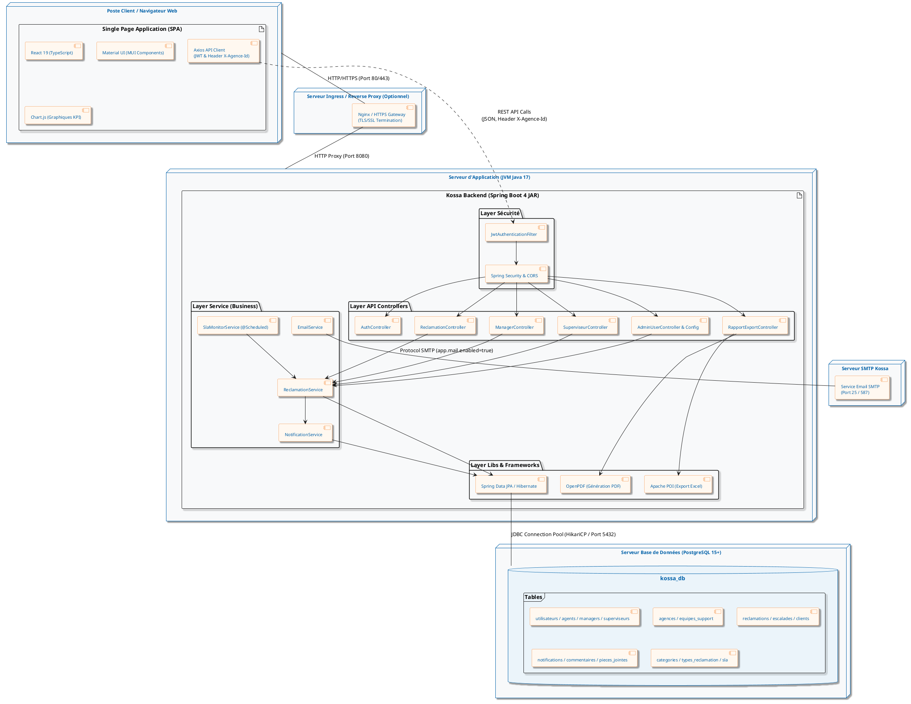

# Diagramme de Déploiement UML - Kossa

Ce document contient le diagramme de déploiement (Deployment Diagram) du système **Kossa** (KOSSA Africa). Il décrit l'architecture matérielle et logicielle, les nœuds d'exécution, la répartition des composants entre Frontend, Backend, Base de données et services externes.

## Code PlantUML

