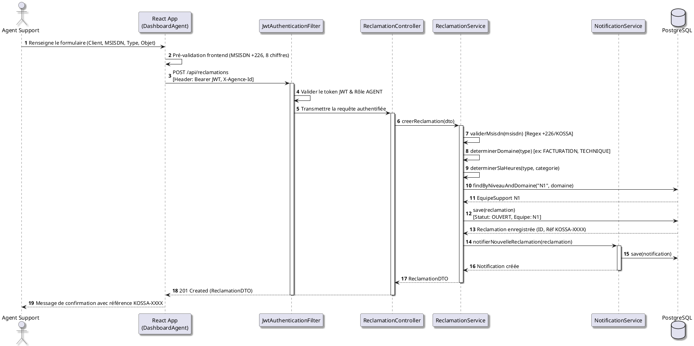
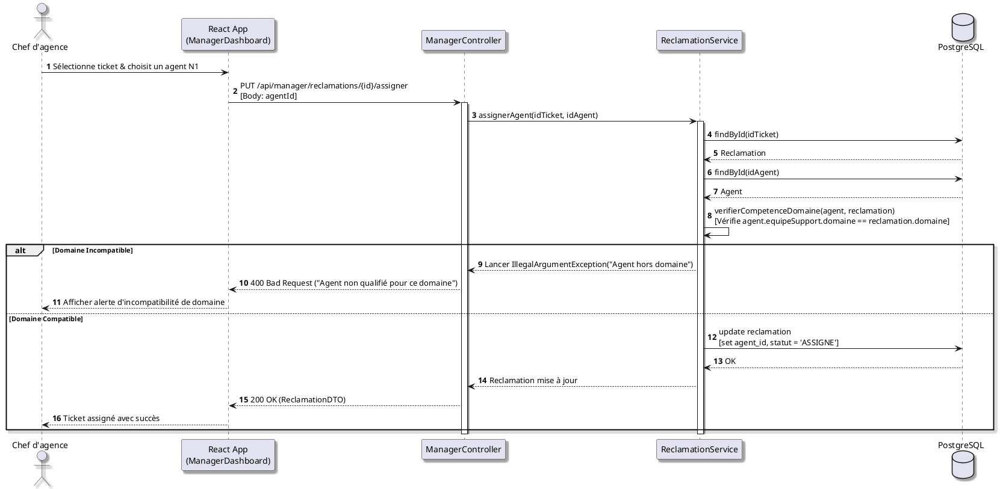
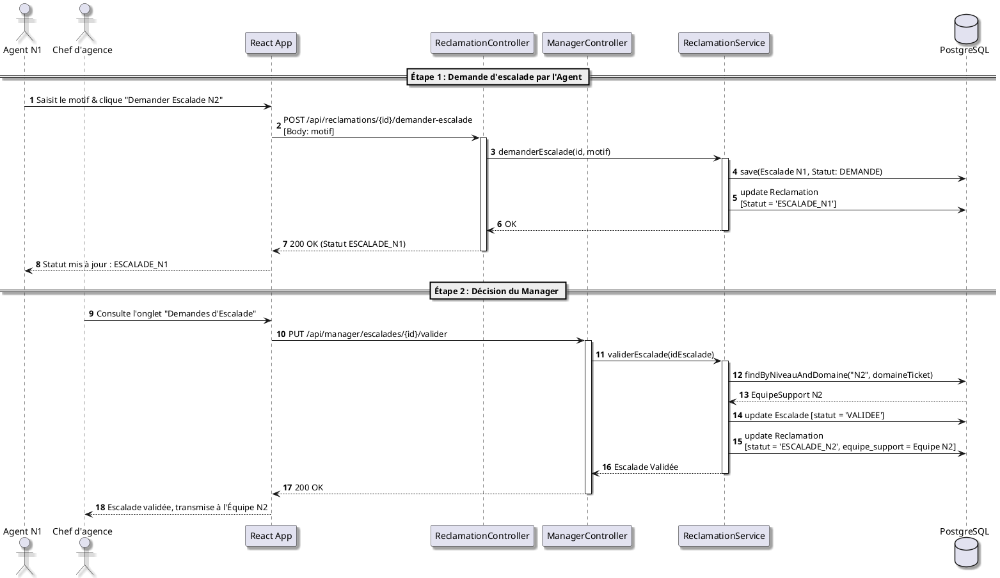
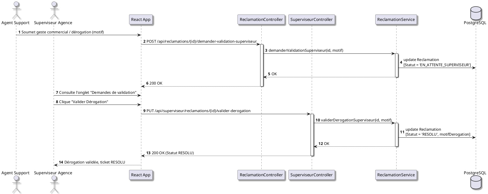
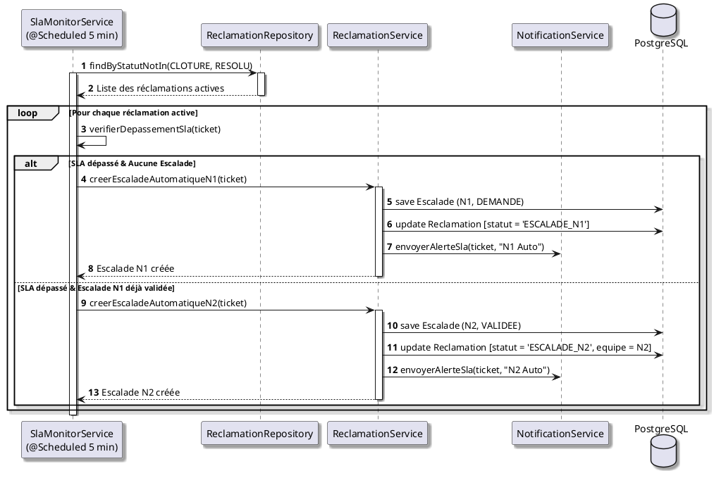

# Diagrammes de Séquence UML - Kossa

Ce document contient les diagrammes de séquence (Sequence Diagrams) modélisant les flux d'exécution dynamiques et les interactions entre l'interface Frontend React, le Backend Spring Boot, les composants de sécurité JWT, la base de données PostgreSQL et les tâches d'arrière-plan.

---

## 1. Création d'une réclamation & Affectation Automatique N1

---

## 2. Assignation par le Manager avec contrôle de compétence

---

## 3. Demande & Validation d'Escalade N1 → N2

---

## 4. Soumission & Validation de Dérogation par le Superviseur

---

## 5. Surveillance SLA Périodique & Escalade Automatique (SlaMonitorService)

