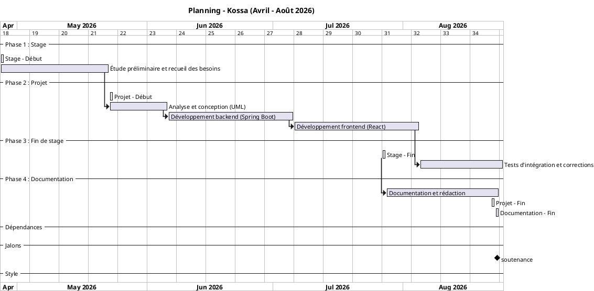

# Figure 3 : Diagramme de Gantt du projet

Ce diagramme illustre le planning du projet avec les dates réelles.

## Code PlantUML

## Description

| Tâche | Dates | Durée |
|-------|-------|-------|
| **Stage** | 27 avril - 27 juillet 2026 | 3 mois |
| Étude préliminaire et recueil des besoins | 27 avril - 22 mai 2026 | 26 jours |
| **Projet** | 23 mai - 22 août 2026 | 3 mois |
| Analyse et conception (UML) | 23 mai - 5 juin 2026 | 14 jours |
| Développement backend (Spring Boot) | 6 juin - 5 juillet 2026 | 30 jours |
| Développement frontend (React) | 20 juin - 19 juillet 2026 | 30 jours |
| Tests d'intégration et corrections | 20 juillet - 8 août 2026 | 20 jours |
| **Documentation** | 27 juillet - 23 août 2026 | 27 jours |
| Soutenance | 23 août 2026 | - |

**Durée totale du stage** : 3 mois (27 avril - 27 juillet 2026)
**Durée totale du projet** : 3 mois (23 mai - 22 août 2026)
**Documentation** : 27 juillet - 23 août 2026

*(Source : réalisation personnelle)*
