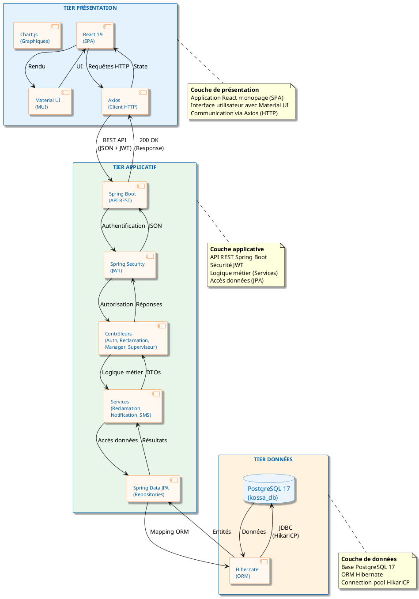

# Figure 5 : Architecture globale en 3-tiers

Ce diagramme illustre l'architecture en trois-tiers du système Kossa.

## Code PlantUML

## Description

| Couche | Technologie | Rôle |
|--------|-------------|------|
| **Tier Présentation** | React 19, MUI, Axios, Chart.js | Interface utilisateur (SPA) |
| **Tier Applicatif** | Spring Boot, Spring Security, JPA | API REST, logique métier, sécurité |
| **Tier Données** | PostgreSQL 17, Hibernate | Stockage et persistence des données |

**Flux de communication :**
1. **Présentation → Applicatif** : Requêtes HTTP/REST (JSON + JWT)
2. **Applicatif → Données** : Accès via JPA/Hibernate (JDBC)
3. **Données → Applicatif** : Résultats des requêtes
4. **Applicatif → Présentation** : Réponses JSON

*(Source : réalisation personnelle)*
