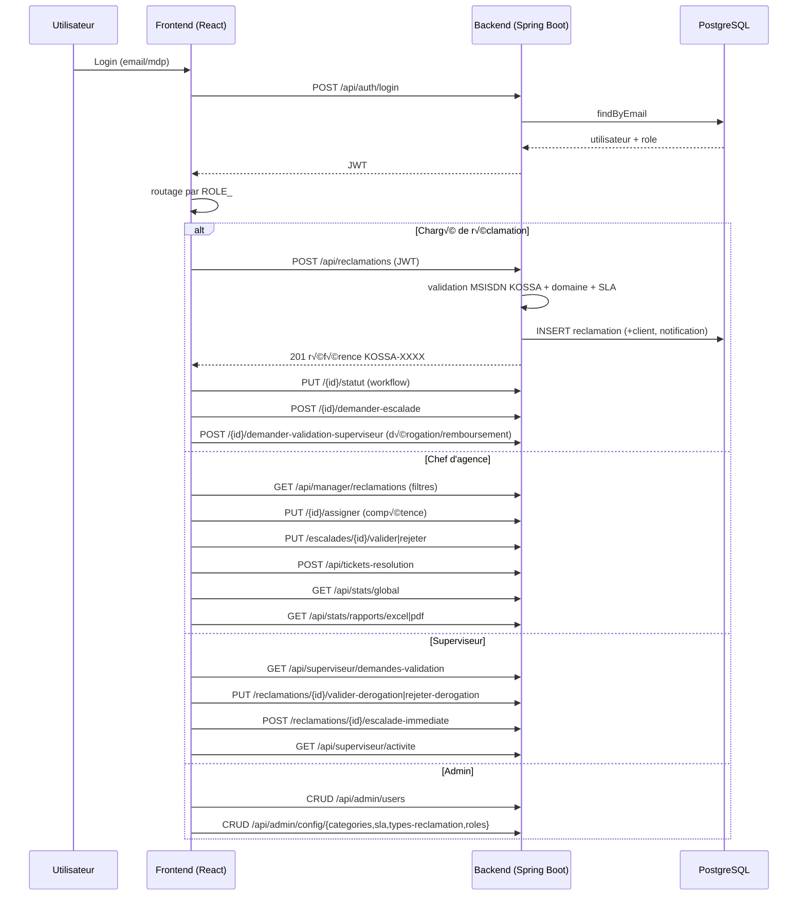

# Kossa KOSSA  Schéma d'utilisation complète du projet

Ce document décrit, sous forme de schémas, comment le projet **Kossa** est organisé et utilisé de bout en bout :
architecture, acteurs, cycle de vie d'une réclamation, modules et flux de données.

---

## 1. Vue d'ensemble de l'architecture

```
                          ┌─────────────────────────────────────────────┐
                          │              NAVIGATEUR (Client)            │
                          │         http://localhost:3000               │
                          │                                             │
                          │   ┌───────────────────────────────────────┐ │
                          │   │      Frontend React 19 + MUI 9        │ │
                          │   │  - Login (JWT)                        │ │
                          │   │  - AdminUserPanel (utilisateurs)      │ │
                          │   │  - AdminConfigPanel (catégories/SLA)  │ │
                          │   │  - RolesPanel (rôles du référentiel)  │ │
                          │   │  - DashboardAgent (réclamations)      │ │
                          │   │  - ManagerDashboard (supervision)     │ │
                          │   │  - SupervisorDashboard (validation    │ │
                          │   │    dérogations + escalade immédiate)  │ │
                          │   │  - NotificationsPopover (clocher)     │ │
                          │   └──────────────────┬────────────────────┘ │
                          └──────────────────────┼──────────────────────┘
                                                 │ HTTP (JSON) + JWT Bearer
                              ┌──────────────────┴──────────────────┐
                              │         Backend Spring Boot         │
                              │            :8080  (REST API)        │
                              │                                     │
                              │   Contrôleurs (12 modules)          │
                              │   Services (workflow, SLA, email, SMS)   │
                              │   Sécurité (JWT + rôles)            │
                              └──────────────────┬──────────────────┘
                                                 │ JPA / Hibernate
                              ┌──────────────────┴──────────────────┐
                              │        PostgreSQL 17                │
                              │      kossa_db (20 tables)  │
                              └─────────────────────────────────────┘
```

---

## 2. Acteurs & leurs droits

```
                        ┌───────────────────────────────────────────────┐
                        │              UTILISATEUR                      │
                        │        (utilisateurs + agents + managers)     │
                        └──────────────┬────────────────────────────────┘
                                       │ connexion (email + mot de passe)
                                       ▼
        ┌──────────────┬───────────────┬────────────────┬───────────────┬───────────────┐
        ▼              ▼               ▼                ▼               ▼
   ┌─────────┐   ┌──────────┐   ┌───────────┐   ┌────────────┐   ┌──────────────┐
    │ ROLE_   │   │ ROLE_              │   │ ROLE_    │   │ ROLE_     │   │ ROLE_      │
    │ ADMIN   │   │ CHARGE_RECLAMATION │   │ CHEF_AGENCE  │   │ SUPERVISEUR│   │ (sans      │
   └────┬────┘   └────────┬───────────┘   └────┬─────┘   └─────┬──────┘   │ token)     │
        │             │              │                │          └──────┬───────┘
        │             │              │                │                  ▼
        ▼             ▼              ▼                ▼            accès refusé
  ┌─────────────┐ ┌────────────┐ ┌──────────────┐ ┌────────────────┐ (403/401)
  │ /api/admin  │ │ /api/rec   │ │ /api/manager │ │ /api/superviseur│
  │ users/config│ │ lamations  │ │ reclamations │ │  activite      │
  │ utilisateurs│ │ stats/agent│ │ escalades    │ │  demandes-vali-│
  │ config,roles│ │            │ │ agents/equip │ │  dation        │
  └─────────────┘ └────────────┘ │ stats/global │ │  valider/rejet-│
                                 │ rapports CSV │ │  er-derogation │
                                 │    /PDF      │ │  escalade-imme-│
                                 └──────────────┘ │  diate         │
                                                 └────────────────┘

  Rôles métier du référentiel (roles_referentiels) :
  ┌─────────────────────────┬──────────┬─────────┐
  │ Code                    │ Profil   │ Niveau  │
  ├─────────────────────────┼──────────┼─────────┤
  │ ROLE_CHARGE_RECLAMATION │ AGENT    │ AGENCE  │  → enregistre les plaintes
  │ ROLE_AGENT_SAV_N1       │ AGENT    │ N1      │  → premier niveau de traitement
  │ ROLE_AGENT_SAV_N2       │ AGENT    │ N2      │  → traitement spécialisé
  │ ROLE_CHEF_AGENCE        │ CHEF_AGENCE  │ AGENCE  │  → supervise une agence
  │ ROLE_CHEF_SAV           │ CHEF_SAV  │ AGENCE  │  → pilote l'équipe SAV
  │ ROLE_GESTIONNAIRE       │ GESTIONNAIRE  │ CENTRAL │  → pilote le flux central
  │ ROLE_SUPERVISEUR        │ SUPERVISEUR  │ CENTRAL │  → valide dérogations/remboursements, escalade immédiate
  │ ROLE_ADMIN              │ ADMIN    │ CENTRAL │  → administre la plateforme
  │ ROLE_ADMIN_AGENCE       │ ADMIN    │ AGENCE  │  → admin par agence (gestion restreinte)
  └─────────────────────────┴──────────┴─────────┘

  Admin par agence :
  ┌────────────────────────┬─────────────────────────┐
  │ Email                  │ Agence                   │
  ├────────────────────────┼─────────────────────────┤
  │ admin.ouaga@kossa.bf    │ Agence Ouaga 2000        │
  │ admin.bobo@kossa.bf     │ Agence Bobo Dioulasso    │
  │ admin.koudougou@kossa.bf│ Agence Koudougou         │
  └────────────────────────┴─────────────────────────┘
  → ne peut gérer que les utilisateurs de sa propre agence
```

---

## 3. Cycle de vie d'une réclamation (workflow)

```
  CHARGE_DE_RECLAMATION       CHEF_AGENCE / CHEF_SAV               AGENT SAV N2        SUPERVISEUR
   │                              │                              │                    │
   ▼                              ▼                              ▼                    ▼
┌──────────┐   enregistrement ┌──────────┐  affectation     ┌──────────────┐   ┌────────────────┐
│  1. CRÉATION │──────────────▶│  2. ASSIGNÉ  │──────────────▶│  3. TRAITEMENT   │   │ 4. DÉROGATION/  │
 │  OUVERT      │  (auto: SLA,  │  (par Chef d'agence│               │  EN_TRAITEMENT   │   │    REMBOURSEMENT│
│              │   domaine,    │   compétence)│               │  EN_COURS        │   │    → soumission │
│              │   référence   │              │               └───────┬────────┘   │    EN_ATTENTE_  │
└──────┬───────┘   KOSSA-XXXX)  └──────┬───────┘                       │            │    SUPERVISEUR  │
       │                              │                              │            └───────┬────────┘
       │      résolu ?                │  impossible ?                 │                    │
       ▼                              ▼                              ▼                    │
┌─────────────────┐         ┌──────────────────┐        ┌──────────────────┐            │
│  5. RÉSOLUTION  │         │  6. ESCALADE     │        │  7. VALIDATION   │            │
│  TicketResolution│         │  N1 → N2         │        │  par Chef d'agence     │            │
│  → RESOLU        │         │  DEMANDE/EN_ATTE │        │                  │            │
└────────┬────────┘         └────────┬─────────┘        └────────┬─────────┘            │
         │  Chef d'agence valide           │  Chef d'agence valide/rejette    │                       │
         ▼                          ▼                            ▼                       ▼
┌─────────────────┐         ┌──────────────────┐        ┌──────────────────┐   ┌──────────────────┐
│  8. CLÔTURE     │         │  ESCALADE_VALIDEE│        │  REJET            │   │  VALIDATION      │
│  CLOTURE        │         │  (N2 traite)      │        │  → retour EN_COURS│   │  SUPERVISEUR     │
└─────────────────┘         └──────────────────┘        └──────────────────┘   │  → RESOLU / rejet │
                                                                                │  → EN_COURS       │
                                                                                └──────────────────┘

  Transitions de statut autorisées (StatutReclamation) :
  OUVERT ──▶ ASSIGNE ──▶ EN_TRAITEMENT ──▶ EN_COURS ──▶ RESOLU ──▶ CLOTURE
    │  ▲                                                     ▲
    │  │         (escalade)                                  │
    └──┴──▶ ESCALADE_N1 ──▶ ESCALADE_N2 ──▶ (validation chef d'agence)
  REOUVERT ⠀── possible depuis RESOLU/CLOTURE
  EN_ATTENTE_SUPERVISEUR ──▶ RESOLU (validation) / EN_COURS (rejet)
  REGULARISEE (régularisation immédiate N1) ──▶ CLOTURE
  ⚠ Une fois CLOTURE : plus aucune transition n'est autorisée.
```

---

## 4. Utilisation détaillée par module

### 4.1 Connexion
```
Utilisateur ──▶ Login (email + mot de passe, œil afficher/masquer)
                     │
                     ▼
          POST /api/auth/login ──▶ JWT ──▶ stocké (localStorage)
                     │
                     ▼
   Routage selon ROLE_ : ADMIN‚ÜíAdminSection | CHEF_AGENCE‚ÜíManagerDashboard | CHARGE_RECLAMATION‚ÜíDashboardAgent
```

 ### 4.2 Espace Admin
 ```
 AdminSection (3 onglets)
  ├── 1. Utilisateurs ──▶ AdminUserPanel
   │      ├── Créer (nom, prénom, email, mot de passe, rôle CHARGE_RECLAMATION/CHEF_AGENCE/SUPERVISEUR/ADMIN)
   │      │      └── si CHARGE_RECLAMATION : sélection obligatoire de l'équipe de support (domaine + niveau)
  │      ├── Affecter/Changer l'équipe de support d'un agent existant (bouton « Équipe »)
  │      ├── Modifier / Réinitialiser le mot de passe
  │      └── Révoquer (avec ConfirmDialog)
  ├── 2. Catégories / SLA / Types ──▶ AdminConfigPanel (3 sous-onglets)
  │      ├── Catégories  : CRUD (un SLA associé max → dropdown slasDisponibles)
  │      ├── SLA         : CRUD complet (création, modification, suppression  suppression refusée si liée à une catégorie)
  │      └── Types       : CRUD complet (création, modification, suppression  suppression refusée si utilisé par des réclamations)
  └── 3. Rôles ──▶ RolesPanel
         └── CRUD des rôles du référentiel (code, libellé, profil, niveau, description)

  AppBar :
   ├── Bouton profil : cliquer sur l'avatar ouvre le dialog du profil utilisateur
   ├── Sélecteur d'agence : admin global / chef d'agence / superviseur peuvent sélectionner une agence pour filtrer les données
   └── Bouton unique « Modifier » : regroupe édition des infos + mot de passe + équipe + agence
 ```

### 4.3 Espace Agent (Chargé / SAV N1)
```
DashboardAgent
 ├── Nouvelle réclamation
 │     MSISDN (+226…) → préfixe KOSSA ? (01,02,03,60-63,70-73) → domaine déduit
 │     nom, prénom, description, type, priorité, canal
 ├── Traitement d'un ticket
 │     statut (workflow) + commentaire
 │     plan d'actions = LISTE DÉROULANTE selon la nature (Mobile Money/FTTH/…)
 ├── Demande d'escalade N2 (motif) → statut DEMANDE, validation Chef d'agence requise
 ├── Recherche / Stats agent / Export
 └── Affichage : uniquement les réclamations affectées à l'agent
```

### 4.4 Espace Manager (Chef d'agence / Gestionnaire)
```
ManagerDashboard
 ├── Liste réclamations (filtres statut/priorité/type)
 ├── Affecter un agent (vérifie la compétence du domaine)
 ├── Commenter le dossier
 ├── Escalades : valider (→ N2) / rejeter (→ retour EN_COURS)
 ├── Résolutions : créer / valider (→ CLOTURE) / rejeter (→ EN_COURS)
 ├── Stats globales + par période
 └── Rapports : export CSV / PDF (avec filtres statut & dates)
```

### 4.5 Espace Superviseur d'agence (dérogations / remboursements)
```
SupervisorDashboard
 ├── Activité du périmètre (supervision centrale de l'agence)
 │      agents, équipes N1/N2, managers + indicateurs (total, statut, priorité)
 ├── Détail : clic sur un agent ou une équipe → réclamations associées
 └── Demandes de validation (dérogations / remboursements)
 │      Valider (motif)  → ticket RESOLU (geste commercial accordé)
 │      Rejeter (motif)  → ticket retourné EN_COURS
 └── Escalade immédiate N2 (motif) → ticket ESCALADE_N2 + escalade N2 créée
```

### 4.5 Notifications & Pièces jointes (transverses)
```
Toute action (création, changement de statut, escalade, résolution)
   ──▶ NotificationService ──▶ table notifications + envoi email + SMS (SmsService)
   ──▶ NotificationsPopover (clocher : compteur non-lues, marquer lue)

Réclamation ──▶ Pièces jointes : upload / liste / suppression (multipart)
```

---

## 5. Diagramme de flux de données (séquence simplifiée)



---

## 6. Matrice Modules ↔ Endpoints ↔ Rôles

| Module | Endpoints | Rôle autorisé |
|---|---|---|
| Auth | `POST /api/auth/login` | Public |
| Auth | `GET /api/auth/me` | Tous les utilisateurs authentifiés |
| Utilisateurs | `/api/admin/users` (GET/POST/DELETE/PUT password), `/api/admin/users/equipes`, `/api/admin/users/{id}/equipe` | ADMIN |
| Config | `/api/admin/config/categories`, `/sla` (GET/POST/PUT/DELETE), `/types-reclamation` (GET/POST/PUT/DELETE), `/roles` | ADMIN |
| En-tête | `X-Agence-Id` (header) | ADMIN_GLOBAL / CHEF_AGENCE / SUPERVISEUR |
| Réclamations | `/api/reclamations/**` (CRUD, statut, search, escalade, pièces jointes) | CHARGE_RECLAMATION/CHEF_AGENCE/ADMIN |
| Manager | `/api/manager/reclamations`, `/assigner`, `/escalades/**`, `/agents`, `/equipes` | CHEF_AGENCE |
| Superviseur | `/api/superviseur/activite`, `/demandes-validation`, `/reclamations/{id}/valider-derogation`, `/rejeter-derogation`, `/escalade-immediate`, `/agent/{id}/reclamations`, `/equipe/{id}/reclamations` | SUPERVISEUR |
| Résolution | `/api/tickets-resolution/**` | CHARGE_RECLAMATION/CHEF_AGENCE/ADMIN |
| Notifications | `/api/notifications/**` | CHARGE_RECLAMATION/CHEF_AGENCE/ADMIN/SUPERVISEUR |
| Statistiques | `/api/stats/agent`, `/global`, `/periode` | CHARGE_RECLAMATION (agent) / CHEF_AGENCE (global) |
| Rapports | `/api/stats/rapports/excel`, `/pdf` | CHARGE_RECLAMATION/CHEF_AGENCE/ADMIN |
| Sécurité | filtres JWT + règles `hasRole` |  |

---

## 7. Points clés à retenir

1. **Un seul point d'entrée** : le JWT identifie l'utilisateur ; le backend route et filtre par `role`.
2. **6 acteurs métier** : Chargé de réclamation (CHARGE_RECLAMATION), Agent SAV N1/N2 (AGENT_SAV), Chef d'agence (CHEF_AGENCE), Superviseur d'agence (SUPERVISEUR), Admin (ADMIN), Admin par agence (ADMIN_AGENCE)  répercutés dans `roles_referentiels`.
3. **Workflow strict** : chaque changement de statut passe par `StatutReclamation.estValide` + `validerTransitionStatut` (interdit depuis clôturé, ordre imposé).
4. **SLA automatique** : `dateEcheance` calculée à la création selon le **type** (Mobile Money 12h, Facturation 48h, autres 24h) ; SLA de la catégorie en repli.
5. **MSISDN contrôlé** : seuls les préfixes KOSSA (`01,02,03,60,61,62,63,70,71,72,73`) sont acceptés.
6. **Priorité contrôlée** : seules `FAIBLE`, `MOYENNE`, `CRITIQUE` sont acceptées (création et modification)  toute autre valeur est refusée par le backend.
7. **Plan d'action contextuel** : dropdown des actions proposées selon la nature de la réclamation.
8. **Traçabilité** : commentaires + `historique_tickets` à chaque transition.
9. **Départements** : 5 domaines (Mobile Money, FTTH, Internet, Facturation, Technique), chacun avec équipes N1 et N2 ; routage automatique à la création.
10. **Superviseur actif** : supervision de l'ensemble des domaines de son agence ; il valide/rejette les dérogations et peut escalader immédiatement en N2.
